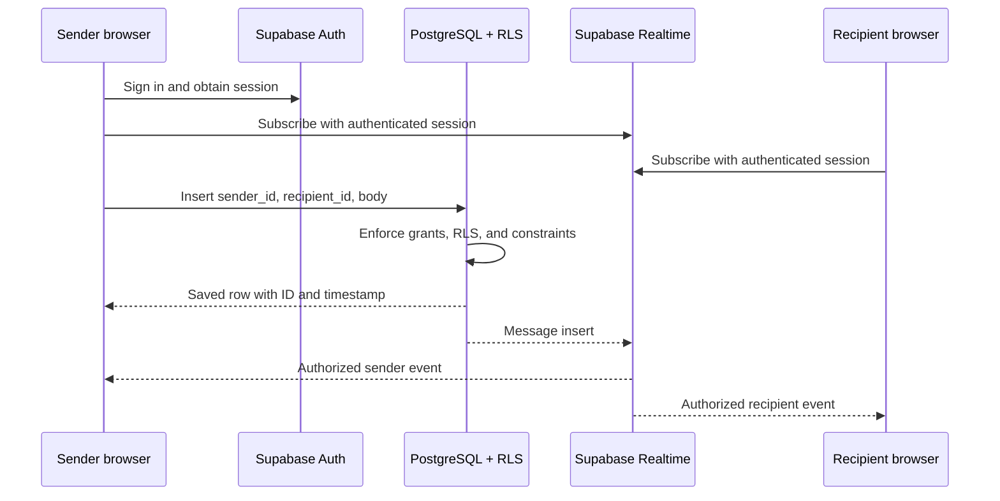

# ChatApp — Private Messaging

A responsive private messaging app built with Angular 20, TypeScript, PrimeNG 20.4.0,
Tailwind CSS, and Supabase.

**Current client transport: Supabase Realtime.** The repository also retains an
ASP.NET Core SignalR backend and its tests, but the current Angular client does not
connect to `/hub`. Vercel hosts the Angular app as a static site; live messages come
from Supabase. The repository name does not identify the active client transport.

## Stack and responsibilities

| Technology | Purpose |
| --- | --- |
| Angular + TypeScript | Pages, routing, form logic, and reactive state |
| PrimeNG 20.4.0 | Buttons, password inputs, avatars, badges, and loading skeletons |
| Tailwind CSS | Layout, spacing, colors, and responsive styles; no SCSS |
| Supabase Auth | Registration, email confirmation, login, and sessions |
| Supabase PostgreSQL | Profiles and persistent messages |
| PostgreSQL row-level security (RLS) | Restricts database access to permitted rows |
| Supabase Realtime | Live message insert notifications |
| ASP.NET Core SignalR | Retained backend implementation, separate from the current client |

## Run locally

Install Node.js/npm compatible with Angular 20. The current frontend does not need
the ASP.NET server to send or receive messages.

From the repository root:

```powershell
cd ChatApp.client
npm ci
npm start
```

Open [http://localhost:4200](http://localhost:4200).

`npm ci` installs the versions recorded in `package-lock.json`. `npm start` starts
Angular's development server. Authentication, history queries, message inserts,
and live events use the configured Supabase project directly.

## Deploy to Vercel

1. Import this GitHub repository into Vercel.
2. Keep the Vercel project root at the repository root.
3. Use the committed [vercel.json](vercel.json) configuration.
4. Add the deployed origin and `/chat` redirect URL to Supabase Auth URL Configuration.

The Vercel build command is:

```text
cd ChatApp.client && npm ci && npm run build
```

Angular writes its static output to `ChatApp.server/wwwroot`, which Vercel publishes.
The rewrite to `index.html` allows direct navigation to routes such as `/login` and
`/chat`. This deployment does not run the retained .NET backend.

## Supabase configuration

The browser project URL and publishable key are configured in
[supabase.config.ts](ChatApp.client/src/app/supabase.config.ts).
Publishable keys are intended for browser clients. Never place a service-role or
secret key in frontend code; the user session, database grants, and RLS enforce access.

In Supabase **Authentication → URL Configuration**:

- Set Site URL to the app origin, such as `http://localhost:4200` locally.
- Allow `http://localhost:4200/chat` for local email confirmation redirects.
- Allow the deployed app's `/chat` URL.
- If serving the built frontend through ASP.NET, also allow
  `http://localhost:5180/chat` or `https://localhost:7145/chat` as appropriate.

Keep email confirmation enabled and configure production SMTP for confirmation emails.
The database schema is recorded in [supabase/schema.sql](supabase/schema.sql).
It is already installed in the configured project; do not rerun the entire script
against that project. Realtime delivery requires `public.messages` in the
`supabase_realtime` publication, as recorded in the schema.

## Try messaging

1. Create two accounts using email addresses you control and confirm each email.
2. Sign in using separate browsers, or a normal window and an Incognito window.
3. Open `/chat` in both accounts. Each account's public display profile is created
   when it first opens chat.
4. Refresh People, select the other account, and send a message.
5. Reload to verify that conversation history persists.

Enter sends a message; Shift + Enter inserts a new line. On a phone, selecting a
person opens the conversation, and the back arrow returns to People.
The check mark means the message was **saved**, not read by the recipient.

## Current message flow



The client subscribes to inserts filtered by its user ID as sender or recipient.
It displays events for the selected conversation and merges rows by message ID to
avoid duplicate bubbles when an insert response and a live event contain the same row.
History loads the latest 100 messages in either direction between the two users.
Starting or manually reconnecting reloads history. Use Reconnect if the UI reports
a failed subscription.

## Authentication and database security

- `/chat` uses an Angular route guard that verifies the user with Supabase Auth.
- The browser guard controls navigation; database RLS independently controls data access.
- Signed-in users can discover profile display names and IDs. Emails are not in the directory.
- Users can create or update only their own profile.
- Users can read only messages where they are sender or recipient.
- Message inserts require the session user ID to equal `sender_id`.
- Database constraints reject empty messages, bodies over 4000 characters, and self-messages.
- Message IDs and timestamps are generated by the database.
- Message text is rendered through Angular text interpolation.

## Code map

| File | Responsibility |
| --- | --- |
| [main.ts](ChatApp.client/src/main.ts) | Boots Angular |
| [app.config.ts](ChatApp.client/src/app/app.config.ts) | Router, reactive change detection, PrimeNG theme, and CSS layers |
| [app.routes.ts](ChatApp.client/src/app/app.routes.ts) | Lazy-loaded login/chat routes |
| [auth.guard.ts](ChatApp.client/src/app/auth.guard.ts) | Redirects unauthenticated visitors to login |
| [auth.service.ts](ChatApp.client/src/app/service/auth.service.ts) | Supabase client, user state, and session verification |
| [login.ts](ChatApp.client/src/app/login.ts) | Registration/login validation and requests |
| [login.html](ChatApp.client/src/app/login.html) | PrimeNG login/register form and Tailwind layout |
| [chat.ts](ChatApp.client/src/app/chat.ts) | Search, keyboard handling, drafts, scrolling, and logout |
| [chat.service.ts](ChatApp.client/src/app/service/chat.service.ts) | Profiles, Realtime subscriptions, message inserts, history, and state |
| [chat.html](ChatApp.client/src/app/chat.html) | Responsive messenger UI |
| [styles.css](ChatApp.client/src/styles.css) | Tailwind/PrimeUI imports, fonts, focus, and base styles |
| [schema.sql](supabase/schema.sql) | Tables, constraints, indexes, grants, and RLS policies |

Components manage interaction and presentation; services manage authentication and
data. Angular signals hold changing state, computed signals derive values such as
filtered contacts, and effects handle actions such as scrolling after rendering.
Tailwind utilities live in the HTML templates. PrimeNG CSS layers allow those
utilities to override component styles where needed.

## Build and frontend tests

From the repository root:

```powershell
cd ChatApp.client
npm run build
npm test -- --watch=false --browsers=ChromeHeadless
```

Chrome must be available for the headless tests. The tests cover the root route
outlet and authenticated/unauthenticated guard behavior; they do not provide full
end-to-end coverage of the current Realtime client.
Builds may report the configured 500 kB initial-bundle warning. This warning is
separate from the 1 MB build-error limit.

## Retained SignalR backend

The backend remains in [ChatApp.server](ChatApp.server), targeting .NET 10.
Its `/hub` endpoint verifies Supabase tokens, saves messages using the caller's
token so RLS applies, and then sends `messageReceived` to sender/recipient connections.
The current Angular client does not call that endpoint. Running the backend alone
does not switch the frontend transport back to SignalR.

From the repository root, with the .NET 10 SDK installed:

```powershell
dotnet run --project ChatApp.server/ChatApp.csproj --launch-profile http
dotnet build ChatApp.server/ChatApp.csproj
dotnet test ChatApp.tests/ChatApp.tests.csproj
```

The HTTP launch profile listens at `http://localhost:5180`. After building Angular,
ASP.NET can serve the static frontend from `wwwroot`; that frontend still uses
Supabase Realtime. Backend Supabase settings are in `ChatApp.server/appsettings.json`
and can be overridden with `Supabase__Url` and `Supabase__PublishableKey`.

The backend tests use SignalR connections and a simulated Supabase API to verify
token denial, sender/recipient routing, multiple sender tabs, validation, and no
delivery after a failed save. The script
[verify-chatapp.cjs](ChatApp.client/scripts/verify-chatapp.cjs) checks the retained
SignalR backend with dedicated test accounts; it does not test the current Vercel client.

## Current limits

Messages are one-to-one, with the latest 100 rows loaded per conversation.
Read receipts, typing indicators, presence, attachments, push notifications,
group chats, older-history pagination, and an offline outgoing queue are not implemented.
Use HTTPS for production deployment.
